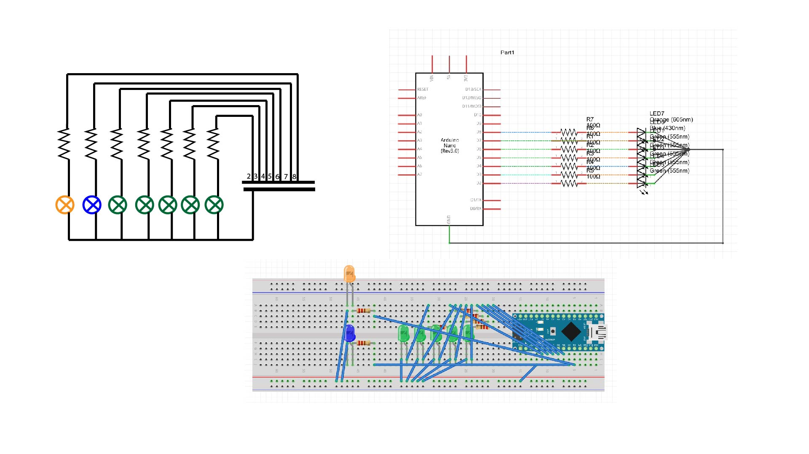

# HW10
Basically, I want to try a bit of everything in this assignment, so I used three different colors of leds in this assignment, each group do something different:
Green leds (5): for these lights, basically, the number of lights that is on is equal to the tens digit of the seconds number, means 0-9 seconds, lights are all off, 10-19 seconds, one light is on, etc. When the second reaches 60, all the lights are reset to off.
Yellow led (1): the yellow would keep being brighter throughout the minute and reset at 60 seconds.
Blue led (1): basically, it blinks every seconds, meaning it is on for half of a second and off for the other half…

Image on repo:  
